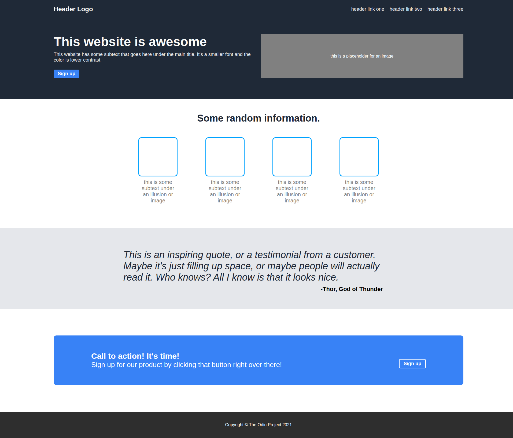

# Landing Page Project
By Nway Nway Zay Ya

This is a landing page project built as part of [The Odin Project's](https://www.theodinproject.com/) Foundations course. The goal was to replicate a provided design mockup (PNG) using only HTML and CSS.

## 🚀 Features

- Responsive layout using Flexbox
- Clean, modular CSS structure
- Organized content layout with:
  - Hero section
  - Information tiles
  - Testimonial quote
  - Call-to-action banner
  - Footer

## 🧠 What I Learned

- Building a static site from a visual design
- Flexbox layout techniques
- Styling reusable components
- Working with consistent color and typography

## 🔧 Technologies Used

- HTML5
- CSS3 (Flexbox)

## 📸 Screenshot

## 🎯 Future Improvements

- Add responsiveness for mobile and tablet
- Replace placeholders with real content
- Improve accessibility (semantic HTML, `alt` attributes, etc.)

---
